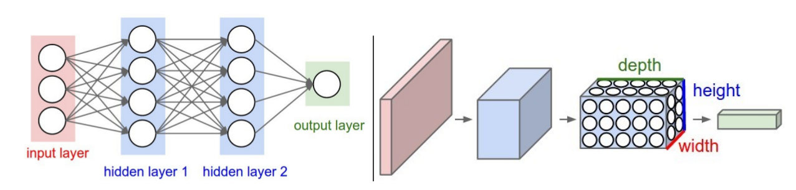
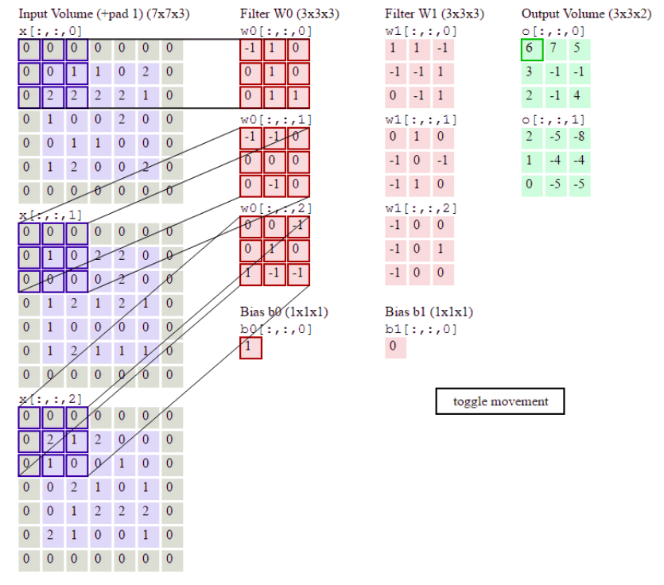
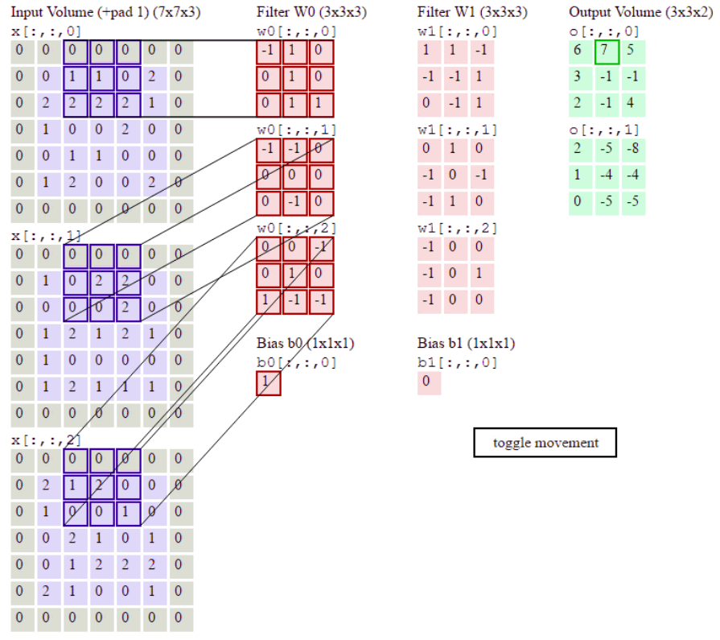
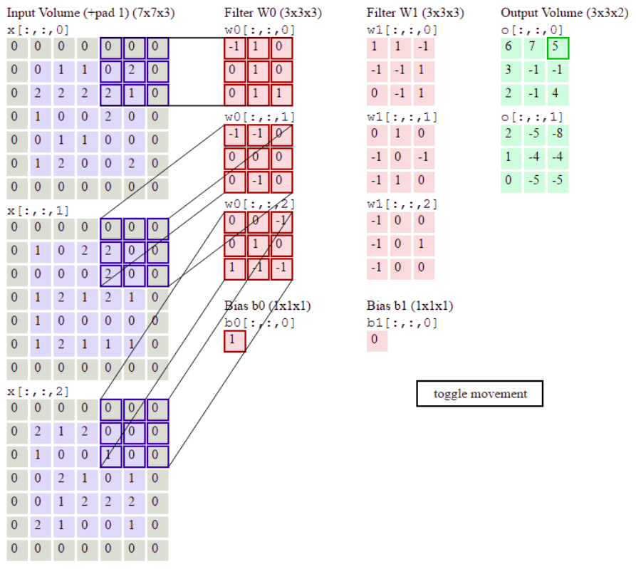
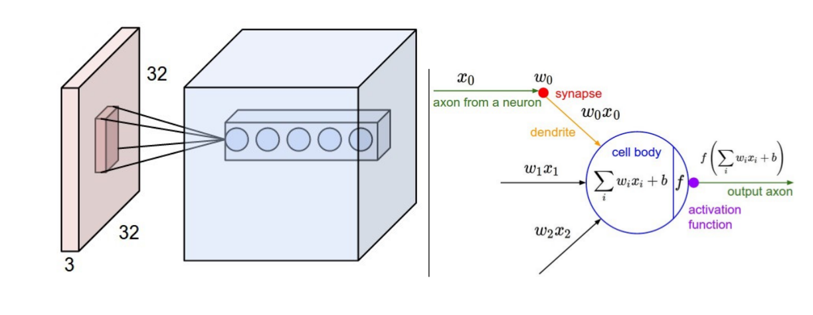

# 模型——卷积神经网络

　　卷积神经网络(Convolutional Neural Networks, CNN)与全连接神经网络一样，都可以看成：

- 可微分的函数，从输入空间映射到输出空间（经过一系列点乘和非线性操作）；
- 由神经元与需要学习的权重和偏置组成。

　　下图是全连接神经网络和卷积神经网络的图，可以很直观的看到神经元的组织结构。全连接神经网络的神经元是向量的形式组织的；而2D卷积神经网络的神经元是以三维(width, height, and depth)张量的形式组织的，也可以说是特征图。

　　一个简单的卷积网络一般由一系列的层链接而成，每个层将一个三维张量转换成另一个三维张量，并且每个层的操作都必须是可微分的。一般卷积神经神经网络都包括：卷积层(Convolutional Layer)、池化层(Pooling Layer)和全连接层(Fully-connected Layer)。

​	一个简单的卷积网络结构：[INPUT - CONV - RELU - POOL -FC]。

## １、卷积层

​      **卷积层的参数**由一系列的可以学习的滤波器(filters)或者卷积核构成。每个滤波器由也是一个三维张量(width, height, and depth)，深度由输入张量的深度(通道数)决定。

​      **卷积层有四个超参数**：

         1. 输出张量的深度或者通道数(the depth of the output volume) D；
         2. 滤波器(Filter)或者卷积核的尺寸F；
         3. 卷积步长(Stride) S，通常为2；
         4. 边缘补0数量(Pad)，可以控制输出张量的尺寸。

- 卷积操作

  例子:滤波器尺寸为3，输出通道数为2，卷积步长为0，pad为１。

  进行卷积操作时，每个滤波器沿着输入张量的宽和高的方向移动，做点乘计算，产生一张二维的特征图。多个滤波器卷积产生的二维特征图叠起来构成三维的输出张量。

  

  

  
  $$
  O[0, 0, 0]=X[:3,:3,0]*w0[:,:,0]+X[:3,:3,1]*w0[:,:,1]+X[:3,:3,2]*w0[:,:,2]+b0
  $$

- 
- $$
  O[1, 0, 0]=X[2:5,:3,0]*w0[:,:,0]+X[2:5,:3,1]*w0[:,:,1]+X[2:5,:3,2]*w0[:,:,2]+b0
  $$
- 
- $$
  O[2, 0, 0]=X[4:,:3,0]*w0[:,:,0]+X[4:,:3,1]*w0[:,:,1]+X[4:,:3,2]*w0[:,:,2]+b0
  $$
- ... ...

- 神经网络角度看卷积操作

  

  ​      卷积层与全连接层主要的不同在于：卷积层的神经元间只是局部链接，输出的神经元只与输入的部分神经元有关。

- 输出张量(特征图)的尺寸计算

  ​      输入张量的尺寸为W1×H1×D1，滤波器尺寸为F，滤波器个数为K，卷积步长为S，补0数量为P，输出张量的尺寸为：

  - W2 = (W1-F+2P)/S+1
  - H2 = (H1-F+2P)/S+1
  - D2 = K

## 2、池化层

​      卷积网络中通常会在两个卷积层之间加上一个池化层，用于减小隐藏层神经元的数量，从而减小计算量，同时还能控制过拟合。

​      池化层没有可学习的参数，主要有**两个超参数**：

1. 池化窗口的尺寸F；
2. 卷积步长(Stride) S，通常为2；

- 池化操作

  池化操作单独的作用于每张特征图(通道)，池化窗口沿着特征图的宽和高的方向移动，做Max操作。通常情况下，设置池化层的窗口尺寸为2，步长为2。

  

- 输出特征图的尺寸计算

  输入张量的尺寸为W1×H1×D1，窗口尺寸为F，窗口步长为S，输出张量的尺寸为：

  - W2 = (W1-F)/S+1
  - H2 = (H1-F)/S+1
  - D2 = D1

