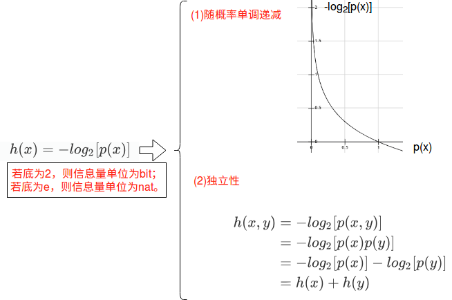

# 策略

构建了模型之后，我们需要面临一个问题：如何制定一个合理的规则找到模型的最优参数？

## 1. 重新看数据标签与模型（离散概率分布）

- 将标签one-hot向量看成真实概率分布p(x)

  

  

- 将模型预测结果看成近似分布q(x)

  

**问题**：如何让模型预测出的分布接近真实分布？

## 2. 交叉熵

### 2.1 信息

#### 2.1.1 什么是信息？

- 信息的***定义***

  一个事件发生的***惊喜度***。

- 信息的***特性***

  - 信息关于概率***单调递减***：概率越小的事件发生，信息量越大；概率越大的事件发生，信息量越小。

  - 信息具有***独立性***：以h(.)表示信息函数，若事件x与y独立，会有以下关系
    $$
    h(x,y)=h(x)+h(y)
    $$

#### 2.1.2 怎么度量信息？

　　通过事件发生的概率来度量信息，可以设计信息函数：

### 2.2 信息熵

- 信息熵的***定义***

  平均信息/信息的期望：
  $$
  \begin{align}
  H(x)&=\sum_{i=1}^{n} p(x_i)[-log_2 p(x_i)](信息的加权平均)\\
  &=E_{x_i\sim p(x_i)}[-log_2 p(x_i)](信息的期望)
  \end{align}
  $$

- 信息熵的***功能***

  信息熵可以***描述确定性***：

  - 
  - 

### 2.3 KL散度(相关熵)

在机器学习里经常需要面对一个问题：如何度量真实分布与近似分布的距离？

可以用KL散度(相关熵)度量两个分布的距离。

- KL散度的**定义**
  $$
  \begin{align}
  KL(p||q)=-\sum_{i=1}^{n} p(x_i)\log(\frac{q(x_i)}{p(x_i)})
  \end{align}
  $$

- KL散度的**性质**

  - 非对称
    $$
    KL(p||q)\not\equiv KL(q||p)
    $$

  - 非负(只有两个分布完全相等的时候为0)
    $$
    KL(p||q)\geq0
    $$

### 2.4 交叉熵(简化了KL散度)

　　KL散度是近似分布q(x)与真实分布p(x)的距离。
$$
\begin{align}
KL(p||q)=-\sum_{i=1}^{n} p(x_i)\log(q(x_i))-&\underline{[-\sum_{i=1}^{n} p(x_i) \log(p(x_i))]}
\\& 真实分布的信息熵(常量)
\end{align}
$$
因为第二项是常量，所以可以不考虑，保留第一项即是交叉熵：
$$
\begin{align}
CE=-\sum_{i=1}^{n} p(x_i)\log(q(x_i))
\end{align}
$$
　　因此，也可以简单地将交叉熵看成是近似分布q(x)与真实分布p(x)的距离，距离越小两个分布越相似。

## 3. 最优化问题——最小化交叉熵损失

　　图片对应的标签是真实概率分布p(x)，模型预测图片的结果是近似概率分布q(x)，如果它们的交叉熵小，则说明近似的结果很接近真实。因此，我们可以借助交叉熵设计一个规则来找模型的最优参数，即找到交叉熵最小的模型参数。

​	假设一个实例$x$对应的标签为$y$(看成真实分布$p(x)$)；分类器模型为$f_\theta(x)$，$f_\theta^i(x)$表示分类结果的第$i$维。通过交叉熵损失找模型最优参数$\theta^*$的过程可以被表述为一个最优化问题(即交叉熵损失函数的具体形式)：
$$
\max_{\theta} -\sum_{i=1}^{n} y^i\log(f_\theta^i(x))
$$
注意交叉熵是一个标量。

### 4 .Pytorch中的交叉熵损失函数

　　Pytorch带有交叉熵损失函数torch.nn.CrossEntropyLoss()，它做了一些改变：

- 去掉求和符号

  　　因为$y$为one-hot向量，所以只有维度为１的那一项不为0，其它项为0。实际上可以将交叉熵损失写成一项：
  $$
  loss(f_\theta(x), target)=-log(f_\theta^{target}(x))
  $$
  其中target为标量标签，而不是one-hot标签。

- 合并Softmax

  torch.nn.CrossEntropyLoss()合并了softmax，因此模型的最后一层可以不用是softmax：
  $$
  loss(f_\theta(x), target)=-log(\frac{\exp f_\theta^{target}(x)}{\sum_i \exp f_\theta^{i}(x)})
  $$
  

