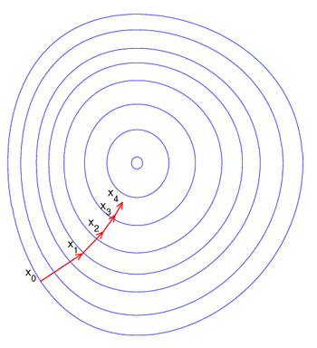
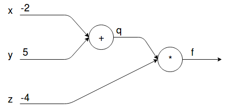
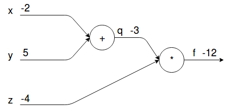
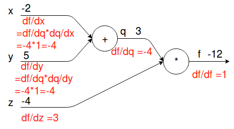
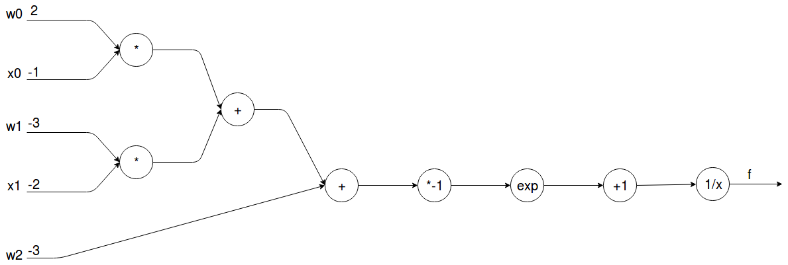
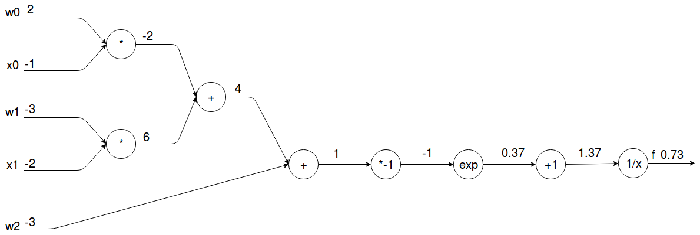
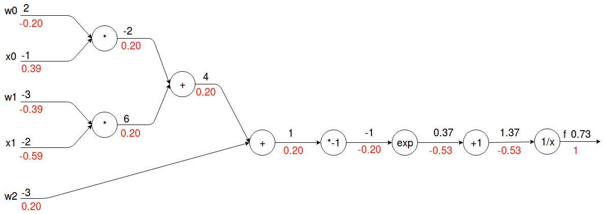

# 算法

## 1. 梯度下降法

### 1.1 导数

​      $f(x)$为关于一维变量$x$的函数，其导数的定义为：
$$
f'(x_0)=\lim_{\Delta x \to0} \frac {f(x_0+\Delta x)-f(x_0)}{\Delta x}
$$
表示函数在$x_0​$位置，沿$x​$轴方向的变化率，带有方向与变化倍率的信息：

- 方向

  在变化$\Delta x​$为正的情况下：$f'(x_0)​$为正，则函数值将增加；$f'(x_0)​$为负，则函数值将降低。

- 变化倍率

  在自变量变化$\Delta x$的情况下，函数值变化$f'(x_0)$倍的$\Delta x$。

  

  导数的另一个重要解读：**导数指向函数上升的方向**。

### 1.2 梯度

　　$J( \boldsymbol{\theta})​$为关于多维变量$(\theta^{(1)},\theta^{(2)},...,\theta^{(n) })​$的函数。

- 偏导数

  $J( \boldsymbol{\theta})​$在$\boldsymbol{\theta}_0​$处关于$\theta^{(1)}​$的导数称为偏导:
  $$
  \frac{\partial{J(\boldsymbol{\theta}_0})}{\partial{\theta^{(1)}}}=\lim_{\Delta \theta^{(1)} \to0} \frac{J(\theta^{(1)}_0+\Delta \theta^{(1)},\theta^{(2)}_0,...,\theta^{(n)_0 })-J(\theta^{(1)}_0,\theta^{(2)}_0,...,\theta^{(n)}_0)}{\Delta \theta^{(1)}}
  $$
  表示函数在$\boldsymbol{\theta}_0$位置，沿$\theta^{(1)}$轴方向的变化率。

- 梯度

  梯度为偏导数的向量：
  $$
  \nabla J( \boldsymbol{\theta}) = (\frac{\partial{J(\boldsymbol{\theta}})}{\partial{\theta^{(1)}}}, \frac{\partial{J(\boldsymbol{\theta}})}{\partial{\theta^{(2)}}}, ..., \frac{\partial{J(\boldsymbol{\theta}})}{\partial{\theta^{(n)}}})
  $$

​       梯度的重要解读：**梯度指向函数上升最快的方向，负梯度为函数下降最快的方向**。

## 1.1 原始梯度下降法

​	机器学习中，选取模型最优参数的策略实际上为最小化问题，通常采用梯度下降法求解该最小化问题的近似接。因为负梯度为函数下降最快的方向，所以可以沿着梯度下降的方向找函数的最小值。梯度下降法为迭代算法，借助梯度不断更新参数：
$$
\boldsymbol{\theta} \gets \boldsymbol{\theta}-\eta \nabla J( \boldsymbol{\theta})
$$
其中$\eta$为学习率，梯度$\nabla J( \boldsymbol{\theta})$一般用小批量的样本来估计。

- 缺点：

  1. ***采用批梯度下降时，如果每次选取的批数据差异很大，梯度可能会来回震荡。***

  2. ***靠近极小值时收敛速度减慢，可能会在最优值附近来回震荡***。

## 1.2 Momentum(冲量梯度下降法)

　　冲量梯度下降算法的目标是缓解梯度下降法的第一个缺点：***梯度可能因为数据的差异而震荡***。原版的梯度下降法在每次迭代时，丢弃之前的参数更新方向，重新计算新的梯度；而冲量梯度下降法的思想是在前一次的参数更新方向的基础上加上梯度方向，也就是说让之前的梯度信息也影响本次的参数更新方向，从而减缓更新方向的震荡。它的更新式子为：
$$
\boldsymbol{m} \gets \gamma \cdot \boldsymbol{m}+\eta \cdot \nabla J( \boldsymbol{\theta})\\
\boldsymbol{\theta} \gets \boldsymbol{\theta}-\boldsymbol{m}
$$
参数更新时不仅考虑梯度，同事加上一个累积项(冲量)，冲量的比例因子$\gamma$一般取接近1的值如0.9。

　　相比原始梯度下降算法，冲量梯度下降算法有助于加速收敛。当梯度与冲量方向一致时，冲量项会增加，而相反时，冲量项减少，因此冲量梯度下降算法可以减少训练的震荡过程。

## 1.3 AdaGrad(自适应学习速率)

　　AdaGrad的目标是缓解梯度下降法的第二个缺点：***靠近极小值时收敛速度减慢，可能会在最优值附近来回震荡***。因此，最好让学习速率衰减。AdaGrad就是遵循这一思想：在训练迭代过程，让学习速率逐渐衰减。经常更新的参数的学习速率衰减更快。它的更新式子为：
$$
\boldsymbol{s} \gets \boldsymbol{s} + \nabla J( \boldsymbol{\theta}) \odot \nabla J( \boldsymbol{\theta})\\
\boldsymbol{\theta} \gets \boldsymbol{\theta} - \frac{\eta}{\sqrt{\boldsymbol{s}+\epsilon}} \odot \nabla J( \boldsymbol{\theta})
$$
$\boldsymbol{s}$是梯度平方的积累量，在进行参数更新时，学习速率要除以这个积累量的平方根，由于是该项逐渐增加的，那么学习速率是衰减的。$\epsilon$是一个很小的值，为了防止分母为0。

　　AdaGrad其学习速率实际上是不断衰减的，这会导致一个很大的问题，就是训练后期学习速率很小，导致训练过早停止。

## 1.4 RMSprop(AdaGrad的改进版本)

　　RMSprop是对Adagrad算法的改进，主要是解决学习速率过快衰减的问题。其实思路很简单，类似Momentum思想，引入一个超参数，在积累梯度平方项进行衰减。它的更新式子为：
$$
\boldsymbol{s} \gets \gamma \cdot \boldsymbol{s} + (1-\gamma)\cdot \nabla J( \boldsymbol{\theta}) \odot \nabla J( \boldsymbol{\theta})\\
\boldsymbol{\theta} \gets \boldsymbol{\theta} - \frac{\eta}{\sqrt{\boldsymbol{s}+\epsilon}} \odot \nabla J( \boldsymbol{\theta})
$$
可以认为仅仅对距离时间较近的梯度进行积累，其中一般取值0.9，其实这样就是一个指数衰减的均值项，减少了出现的爆炸情况，因此有助于避免学习速率很快下降的问题。

## 1.5 Adam(结合Momentum与AdaGrad)

　　Adam全称Adaptive moment estimation，是Kingma等在2015年提出的一种新的优化算法，其结合了Momentum和RMSprop算法的思想。相比Momentum算法，其学习速率是自适应的，而相比RMSprop，其增加了冲量项。它的更新式子为：
$$
\boldsymbol{m} \gets \beta_1 \cdot \boldsymbol{m} + (1-\beta_1) \cdot \nabla J( \boldsymbol{\theta}) \\
\boldsymbol{s} \gets \beta_2 \cdot \boldsymbol{s} + (1-\beta_2)\cdot\nabla J( \boldsymbol{\theta}) \odot \nabla J( \boldsymbol{\theta})\\
\boldsymbol{m} \gets \frac{\boldsymbol{m}}{1-\beta_1} \\
\boldsymbol{s} \gets \frac{\boldsymbol{s}}{1-\beta_2} \\
\boldsymbol{\theta} \gets \boldsymbol{\theta} - \frac{\eta}{\sqrt{\boldsymbol{s}+\epsilon}} \odot \boldsymbol{m}
$$
前两项和Momentum和RMSprop是非常一致的，由于和的初始值一般设置为0，在训练初期其可能较小，第三和第四项主要是为了放大它们。最后一项是参数更新。其中超参数的建议值是$\beta_1 =0.9$，$\beta_２ =0.999$，$\epsilon = 1e-8$。

## 2. 反向传播算法(Backpropagation)

​	求解最优模型的参数用到梯度下降法，那么梯度是怎么求得的呢？

　　借助***导数表***和***链式法***则求出梯度。

- 从特例看BP算法的原理

  - 简单例子

    求函数$f(x,y,z)＝(x+y)z$在点$(-2, 5,-4)$处的梯度：

    1. 中间变量简化式子

       $q=x+y=3$

       $f=qz=-12$

    2. 需要用到的导数规则

       $\frac{\partial f}{\partial q}=z=-4$;$\frac{\partial f}{\partial z}=q=3$

       $\frac{\partial q}{\partial x}=1​$;$\frac{\partial q}{\partial y}=1​$

    3. 链式法则

       $\frac{\partial f}{\partial x}=\frac{\partial f}{\partial q}\frac{\partial q}{\partial x}=-4*1=-4​$

       $\frac{\partial f}{\partial y}=\frac{\partial f}{\partial q}\frac{\partial q}{\partial y}=-4*1=-4$

    计算图：

    

    1. 正向计算

       

    2. 梯度反向传播（通过链式法则）

       

  - 一个简单神经网络的反向传播过程

    一个单层神经网络的输入维度为2维输入，激活层为sigmoid函数:
    $$
    f(\boldsymbol{w},\boldsymbol{x})=\frac{1}{1+e^{-(w_0x_0+w_1x_1+w_2)}}
    $$
    求其在$\boldsymbol{w}=(2,-3,-3),\boldsymbol{x}=(-1,-2)$处的梯度：

    1. 拆分成5个基本的可微分操作，并给出求导规则：
       $$
       f(x)=\frac{1}{x} \to \frac{\partial{f}}{\partial{x}}=-\frac{1}{x^2}\\
       f_c(x)=c+x \to \frac{\partial{f}}{;\partial{x}}=1\\
       f_a(x)=ax \to \frac{\partial{f}}{\partial{x}}=a\\
       f(x)= e^{x}\\
       f(x,y)=xy \to \frac{\partial{f}}{\partial{x}}=y;\frac{\partial{f}}{\partial{y}}=x
       $$

    2. 构建计算图

       

    3. 正向计算

       

    4. 梯度反向传播(通过链式法则)

       

- BP算法的注意点：
  - 输出必须是标量
  - 每个节点都必须可微
  - 需要先正向计算，再反向计算

## 3. Pytorch中使用梯度下降法

